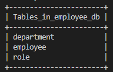
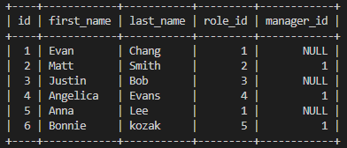
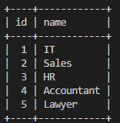
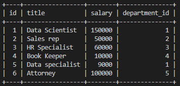

# Employee Tracker

## Description

This project is a command line application that simulates a compan's employee database. This project uses Node.js, Inquirer, and MySQL. The applicaiton allows users to access all information of employees, departments, and roles in the database system. In addition, the application also allows adding new employees, departments, and roles, giving the application more capabilities than just a list application.

## Repository
https://github.com/evan17812/Employee-Tracker

## Screenshot

